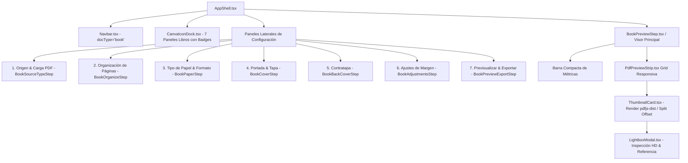

# Plan y Especificación Técnica — Book Studio v4 (Motores Faltantes & Refactorización Unificada)

Este documento combina la especificación técnica de la v4 unificada con el plan detallado de los motores faltantes (Puntos 3 al 9) auditados contra la implementación real de **LEECV** y **Kalpagrafica**.

---

## 1. Visión General y Objetivos
**Book Studio v4** unifica el motor de edición e imposición de libros y folletos dentro de la arquitectura modular compartida (`AppShell.tsx`), eliminando vistas aisladas y garantizando paridad de experiencia con los módulos de Currículum y Tarjeta.

### Objetivos Clave:
1. **Shell Unificado (`docType="book"`)**: Reutilización de `Navbar.tsx`, `CanvaIconDock.tsx` y `DocumentTabsBar.tsx`.
2. **Visor de Páginas Interactivo (`mainSlot`)**: Renderizado vectorial de miniaturas por página mediante `pdfjs-dist` en canvas, con soporte de rotaciones, tachado de eliminadas y reordenamiento manual.
3. **Panel Lateral de Configuración (`panelSlot`)**: Control de imposición y configuración paso a paso.
4. **Inspección HD & Páginas de Referencia (`LightboxModal.tsx`)**: Calibración exacta entre el número de hoja impreso físicamente y la página del PDF.
5. **Subida de Tapas Personalizadas (`type: 'upload'`)**: Soporte completo para cargar archivos de imagen en portada y contratapa.
6. **Gobernanza Cromática & Accesibilidad**: 0 fugas de tokens UI y 100% de cumplimiento en la suite de contraste WCAG 2.1 AA.

---

## 2. Auditoría & Especificación de Motores Faltantes (Puntos 3 a 9)

### Punto 3 — Retiro de Rotación Global en Lote
* **Análisis**: Las herramientas de referencia corrigen la rotación 180° **por hoja individual**, nunca en lote.
* **Acción**: Se retira el panel de "Acciones en Lote" con rotaciones globales de `BookOrganizeStep.tsx`. Cada `ThumbnailCard` ofrece control directo e intuitivo por página.

### Punto 4 — Motor de Corte Manual por Página (`splitOffset`)
* **Problema en LEECV**: En `impositionEngine.ts`, el corte para escaneos de 2 páginas por hoja ("fotocopia") se realiza estrictamente a la mitad (`sheetWidth / 2`). Si el escaneo está desplazado, se corta texto.
* **Solución (Kalpagrafica)**: Permitir ajuste porcentual `splitOffset` por hoja individual (rango 35% a 65%, paso 2%, defecto 50%).
* **Plan de Implementación**:
  1. `impositionEngine.ts`: Añadir `splitOffset?: number` (defecto 50) por hoja.
  2. Reemplazar `halfWidth = sheetWidth / 2` por `splitPoint = sheetWidth * ((sheet.splitOffset ?? 50) / 100)`.
  3. `ThumbnailCard.tsx`: Dibujar línea guía de corte en canvas con controles `◄ ✂ 50% ►` cuando `options.mode === 'fotocopia'`.

### Punto 5 — Textos del Panel & Internacionalización (`useText`)
* **Patrón Canónico**: Los textos explicativos se migran a `src/shared/i18n/catalog/bookStudio.ts` y se consumen mediante `useText()` / `t.book.*`.
* Evita textos hardcodeados en el JSX y mantiene paridad con Landing y Blog.

### Punto 6 — Números e Íconos en el CanvaIconDock
* **Visualización de Etapa**: Superponer un badge numérico circular (círculo 1 a 7) en la esquina de los íconos del dock para que sea visible siempre, incluso en pantallas móviles sin hover.
* **Ajuste Semántico**: Cambiar el ícono del Paso 2 ("Páginas") de `Eye` a `LayoutGrid`.

### Punto 7 — Previsualización de Tapas/Contratapas Insertadas en el Visor
* **Interacción en Vivo**: `ThumbnailCard.tsx` y `PdfPreviewStrip.tsx` dibujan miniaturas de las tapas generadas o subidas antes de la Pág. 1 (portada) y al final (contratapa), incluyendo retiro/dorso en blanco cuando está activado.

### Punto 8 — Motor de Zoom Responsivo Unificado (`useAutoFitZoom`)
* **Problema**: `BookStudioContent.tsx` utilizaba un reset fijo a 100% en lugar de encajar al espacio disponible.
* **Solución**: Extraer la lógica de auto-fit de `App.tsx` a un hook compartido `src/shared/core/utils/useAutoFitZoom.ts` parametrizado por `contentWidthPx` y `isPanelOpen`, usado por CV, Tarjeta y Libro.

### Punto 9 — Inserción de Páginas de Texto con Jerarquía Tipográfica
* **Función**: Botón "+ Agregar página" en `BookOrganizeStep.tsx` con 2 modalidades:
  1. Hoja en blanco.
  2. Hoja de texto con jerarquía usando `displayScale` (`hero`, `sectionHeading`, `lead`) de `uiDesignSystem.ts` y estilos de `COVER_PRESETS`.

---

## 3. Arquitectura de Slots y Componentes

---

## 4. Matriz de Gobernanza y Tokens UI

| Componente | Token Usado | Rol |
| :--- | :--- | :--- |
| Tarjeta Miniatura | `bg-[var(--ui-bg-card)]`, `border-[var(--ui-border)]` | Fondo y contorno de miniatura |
| Fondo Canvas Miniatura | `bg-[var(--ui-bg-panel)]` | Contenedor neutro de pre-carga |
| Indicador Eliminado | `bg-[var(--color-status-danger-muted)]`, `bg-[var(--color-status-danger-base)]` | Etiqueta de aviso de estado |
| Linea de Corte Fotocopia | `border-[var(--color-status-danger-base)]` | Indicador visual de división `splitOffset` |
| Lightbox Modal | `bg-[var(--ui-bg-card)]`, `bg-[var(--ui-bg-panel)]` | Fondo de modal e inspección HD |

---

## 5. Hoja de Ruta de Implementación (Roadmap)

| Fase | Tarea | Componentes Afectados |
| :--- | :--- | :--- |
| **Fase 1** | Motor de Zoom `useAutoFitZoom` | `useAutoFitZoom.ts`, `BookStudioContent.tsx`, `App.tsx` |
| **Fase 2** | Corte manual `splitOffset` por hoja | `impositionEngine.ts`, `ThumbnailCard.tsx` |
| **Fase 3** | Badges numéricos e ícono `LayoutGrid` | `CanvaIconDock.tsx` |
| **Fase 4** | Preview de tapas insertado en visor | `PdfPreviewStrip.tsx`, `ThumbnailCard.tsx` |
| **Fase 5** | Catálogo i18n para Book Studio | `src/shared/i18n/catalog/bookStudio.ts` |
| **Fase 6** | Páginas nuevas de texto con jerarquía | `BookOrganizeStep.tsx`, `impositionEngine.ts` |
